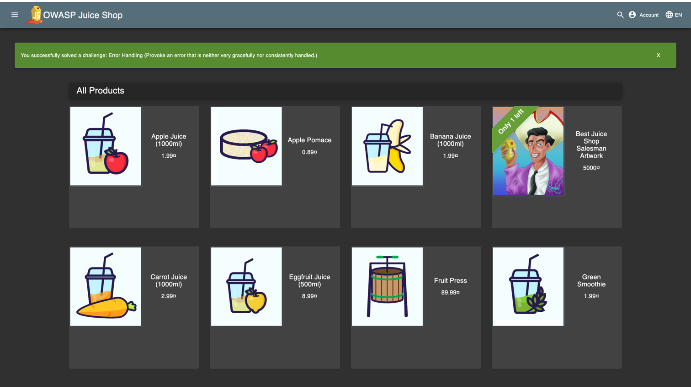
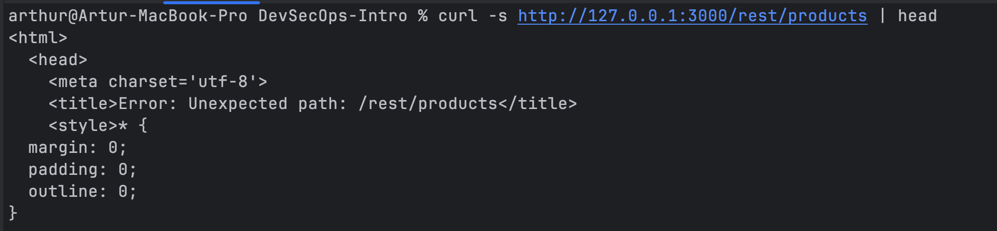

# Triage Report — OWASP Juice Shop

## Scope & Asset
- Asset: OWASP Juice Shop (local lab instance)
- Image: bkimminich/juice-shop:v19.0.0
- Release https://github.com/juice-shop/juice-shop/releases/tag/v19.0.0 - 04 Sep 2025
- Image digest (optional): sha256:2765a26de7647609099a338d5b7f61085d95903c8703bb70f03fcc4b12f0818d

## Environment
- Host OS: <macOS 26.1>
- Docker: Docker version 28.0.4, build b8034c0

## Deployment Details
- Run command used:
`docker run -d --name juice-shop -p 127.0.0.1:3000:3000 bkimminich/juice-shop:v19.0.0`
- Access URL: http://127.0.0.1:3000
- Network exposure: 127.0.0.1 only [x] Yes

## Health Check
- Page load: 

- API check:

## Surface Snapshot (Triage)
- Login/Registration visible: [x] Yes — standard auth form
- Product listing/search present: [x] Yes — products displayed
- Admin or account area discoverable: [x] Yes — account section exists
- Client-side errors in console: [x] No
- Security headers:
`curl -I http://127.0.0.1:3000` - CSP/HSTS missing 

## Risks Observed (Top 3)

1) Overly permissive CORS configuration — the use of `Access-Control-Allow-Origin: *` permits requests from any domain, which increases the risk of cross-site scripting (XSS) and potential data exfiltration.

2) Absence of essential security headers — missing Content Security Policy (CSP) and HTTP Strict Transport Security (HSTS) weakens protection against script injection and man-in-the-middle (MITM) attacks.

3) Publicly accessible functionality without authentication — key features such as the product catalog and authentication endpoints are exposed to unauthenticated users, expanding the attack surface.

## Task 2 — PR Template Setup 

## GitHub Community

Starring repositories helps track useful projects and supports maintainers.
Following developers allows learning from their work and staying updated with industry practices.