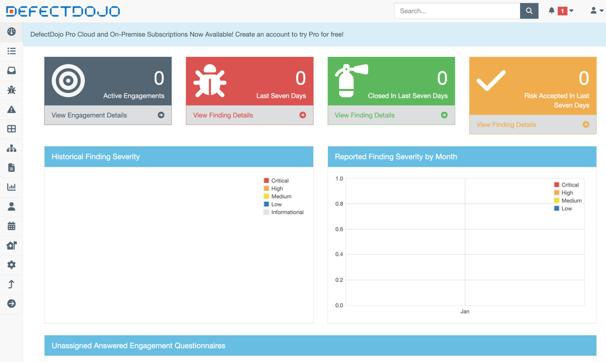
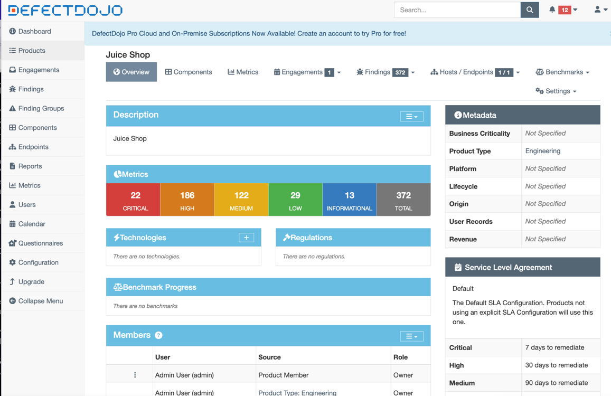

# Task 1

# Task 2

In lab10/imports

# Task 3

## Additional Metrics (Task 3.3)

### Open vs Closed by severity

All findings are currently in **active (open)** state, with no mitigated (closed) findings observed at the time of this snapshot.

* Critical: 22 open / 0 closed
* High: 186 open / 0 closed
* Medium: 122 open / 0 closed
* Low: 29 open / 0 closed
* Informational: 13 open / 0 closed

### Findings per tool

* Semgrep: 25 findings
* Trivy: 185 findings
* Grype: 161 findings
* Nuclei: 1 finding
* ZAP: 0 findings

### SLA status

84 findings with ≤14 days SLA remaining. Dates are in `findings.csv`.

### Top recurring CWE / OWASP categories

Based on imported findings and scanner types:

* CWE-79 — Cross-Site Scripting (XSS)
* CWE-22 — Path Traversal
* CWE-1333 — Inefficient Regular Expression Complexity
* Dependency-related vulnerabilities (Trivy / Grype — CVE-based issues)

These categories indicate a mix of:

* insecure coding practices
* dependency vulnerabilities
* input validation issues
